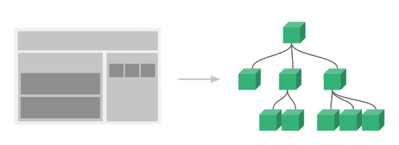

# 개발 환경 설정

## 프로그램 설치

* Chrome 브라우저 설치 [Chrome](https://www.google.com/intl/ko/chrome/)
* VSCode 설치 [Visual Studio Code](https://code.visualstudio.com/)
* Node.js 설치 - 메인화면 - 왼쪽 LTS 설치 [Node.js](https://nodejs.org/ko/)
* vue.js dev tools 검색 - 웹 스토어 에서 설치 [Vue.js Devtools](https://chrome.google.com/webstore/detail/vuejs-devtools/nhdogjmejiglipccpnnnanhbledajbpd)

## 수업 소스 코드 안내

* [깃헙 리포지토리 주소](https://github.com/joshua1988/learn-vue-js)

  * clone 받아 사용하기

* 참고 : 깃 튜토리얼

  * [팀 개발을 위한 Git, GitHub 시작하기(클릭)](http://www.yes24.com/Product/Goods/85382769?Acode=101)
  * [초심자를 위한 Github 협업 튜토리얼(클릭)](https://milooy.wordpress.com/2017/06/21/working-together-with-github-tutorial/)

  

## VSCode 플러그인 설치 및 설정

* 아래 플러그인 설치 후 VSCode 재 실행
  * Vetur
  * Night Owl
  * Material Icon Theme
  * Live Server
  * ESLint
  * Prettier
  * Auto Close Tag
  * Atom Keymap
* File Icon Thema - Material Icon Theme
* Color Thema - Night Owl

## 뷰 개발자 도구 소개 및 실행 방법

html파일 열고 오른쪽 클릭 open

개발자도구 F12 -> vue

# Vue.js 소개

## MVVM 모델에서의 Vue


`View` : 브라우저에서 사용자에게 비춰지는 **화면**

html : 화면에 나타나는 요소 -> DOM 구조

화면에서 버튼 클릭하면 `DOM Listeners`가 이벤트 청취하여 java script에 있는 데이터를 변경하거나 특정 로직 실행

`JavaScript`의 데이터 변했을 때 `Data Bindings`를 이용해 화면에 반영함

## 기존 웹 개발 방식(HTML, Javascript)

[./playground/web-dev.html 실습 코드](./playground/web-dev.html)

일반적으로 vue, react, jquery를 쓰지 않고 웹 개발하는 방법은 HTML, CSS, JS 세 언어로 구성할 수 있음

html 은 dom의 정보를 넣는 것이고 JS는 해당 태그나 dom의 내용을 조작하는 것

## Reactivity 구현

Vue.js 의 핵심 - **Reactivity(반응성)** : 데이터의 변화를 라이브러리에서 감지해 알아서 화면을 자동으로 그려주는 것 => **data binding**

[./playground/vue-way.html 실습 코드](./playground/vue-way.html)

[Object.defineProperty() API 문서 링크](https://developer.mozilla.org/en-US/docs/Web/JavaScript/Reference/Global_Objects/Object/defineProperty)

`Object.defineProperty()` : 객체의 동작 재정의 하는 API

## Reactivity 코드 라이브러리화 하기

라이브러리화 하기

```javascript
function init() {
 object.defineProperty(viewModel, 'str', {... })
}

function render(value) { ... }
 
init(); // 호출!
```


[즉시 실행 함수 MDN 문서 링크](https://developer.mozilla.org/ko/docs/Glossary/IIFE)

즉시 실행 함수 ?

`init()`과 `render`가 애플리케이션 로직에 노출되지 않도록 함

또 다른 스코프(유효범위)에 넣어줌

일반적인 오픈소스 라이브러리들이 변수의 유효범위를 이런 방식으로 관리함

```javascript
(function() {
    ...
})();
```


## Hello Vue.js와 뷰 개발자 도구

ctrl + F12 or 오른쪽 클릭 - 검사


# 인스턴스

## 인스턴스 소개

[./playground/instance.html 실습 코드](./playground/instance.html)

인스턴스는 뷰를 개발할 때 필수로 생성해야하는 코드

생성

```js
new Vue();
```

뷰에서 제공하는 API(기능)와 속성


## 인스턴스와 생성자 함수

왜 인스턴스를 사용하고 생성하는가??

자바스크립트에서 함수를 이용하여 인스턴스를 생성하는 방법은 생성자 함수를 사용하는 방법!

함수의 첫글자 대문자면 생성자!

```js
function Person(name, job) {
    this.name = name;
    this.job = job;
}
```

뷰를 왜 생성자 함수 형태로 찍어내는가?

```js
function Vue() {
    this.logText = function() {
        console.log('hello');
    }
}

var vm = new Vue();
vm.logText(); // hello
```

매번 함수를 새로 정의하는 것이 아니라 미리 정의된 함수 사용할 수 있음 -> 재사용!

[MDN 생성자 함수 설명 문서](https://developer.mozilla.org/ko/docs/Web/JavaScript/Guide/Obsolete_Pages/Core_JavaScript_1.5_Guide/Creating_New_Objects/Using_a_Constructor_Function)

## 인스턴스 옵션 속성

재사용할 수 있는 옵션, 속성을 알아보자

인스턴스에서 사용할 수 있는 속성은 다음과 같음

```js
new Vue({
    el: ,
    template: ,
    data: ,
    methods: ,
    created: ,
    watch: ,
})
```

객체의 key-value 형태

```javascript
var vm = new Vue({
	el: '#app', // app이라는 태그를 찾아 new Vue로 만든 인스턴스를 붙이겠다
	data: {
		message: 'hi'
	}
});
```

위는 아래와 같다

위가 더 가독성이 뛰어남

생성자 안에는 객체가 들어감에 주의하자!

```javascript
var options = {
	el: '#app', // app이라는 태그를 찾아 new Vue로 만든 인스턴스를 붙이겠다
	data: {
		message: 'hi'
	}
	};
var vm = new Vue(options);
```


# 컴포넌트

## 컴포넌트 소개

화면의 영역을 영역별로 구분하여 코드로 관리하는 것



**재사용성**이 핵심

컴포넌트 간에 관계가 생김

## [실습 안내] 컴포넌트 등록 및 실습

[./playground/component.html 실습코드](./playground/component.html)


## 지역 컴포넌트 등록

아래 두 표현은 같은 의미이다.

```javascript
// 전역 컴포넌트
Vue.component('컴포넌트 이름', 컴포넌트 내용);
```

```javascript
net Vue({
    el: '#app',
    components: {
        // 지역 컴포넌트
        '컴포넌트 이름': 컴포넌트 내용
    }
});
```


## 전역 컴포넌트와 지역 컴포넌트의 차이점

지역 컴포넌트 복수형 **components**


전역 컴포넌트는 플러그인, 라이브러리 처럼 전역으로 사용하는 경우에만 사용

일반적으로 지역 컴포넌트 사용

## 컴포넌트와 인스턴스와의 관계

인스턴스 생성하면 `<Root>`가 생겨남

# 컴포넌트 통신 방법 - 기본

## 컴포넌트 통신


## 컴포넌트 통신 규칙이 필요한 이유


`AppHeader` -> `LoginForm`

`LoginForm` -> `AppFooter`

`AppFooter` -> `NavigationBar`

통신 규칙이 없을 때 데이터가 바뀌었을 때 버그 알기 어려움


통신 규칙이 적용되었을 때


방향이 생겼을 때 데이터 추적이 가능하다.

`props`와 `event`를 통해 데이터 주고받음

## props 속성

[./playground/props.html 실습코드](./playground/props.html)

```html
<!-- 공백은 에러 -->
<app-header v-bind: propsdata="message"></app-header>
<!-- 아래처럼 쓰기-->
<app-header v-bind:propsdata="message"></app-header>
```

## event emit

[./playground/event-emit.html 실습코드](./playground/event-emit.html)

## 

## 뷰 인스턴스에서의 this

[this 관련 글 1](https://www.w3schools.com/js/js_this.asp)

[this 관련 글 2](https://medium.com/quick-code/understanding-the-this-keyword-in-javascript-cb76d4c7c5e8)

# 컴포넌트 통신 방법 - 응용

## 같은 컴포넌트 레벨 간의 통신 방법

## 같은 컴포넌트 레벨 간의 통신 방법 구현 1

## 같은 컴포넌트 레벨 간의 통신 방법 구현 2

# 라우터

## 뷰 라우터 소개와 설치

# 뷰 라우터 인스턴스 연결 및 초기 상태 안내

## [실습 안내] routes 속성 설명 및 실습 안내

## 라우터가 표시되는 영역 및 router-view 태그 설명

## 링크를 이용한 페이지 이동 및 router-link 태그 설명

## 라우터 정리 및 학습 방향 안내

# HTTP 통신 라이브러리 - axios

## HTTP 라이브러리와 Ajax 그리고 Vue Resource

## axios 소개 및 오픈 소스를 사용하기 전에 알아야 할 것들

## axios 실습 및 this 설명

## 웹 서비스에서의 클라이언트와 서버와의 HTTP 통신 구조

## 크롬 개발자 도구 네트워크 패널 보는 방법

# 템플릿 문법 - 기본

## 템플릿 문법 소개

## 텍스트 바인딩과 computed 속성

## [실습 안내] 뷰 디렉티브와 v-bind

## [실습 풀이] 클래스 바인딩, v-if, v-show

## 모르는 문법이 나왔을 때 공식 문서를 보고 해결하는 방법

## methods 속성과 v-on 디렉티브를 이용한 키보드, 마우스 이벤트 처리 방법

# 템플릿 문법 - 실전

## watch 속성

## watch 속성 vs computed 속성

## computed 속성을 이용한 클래스 코드 작성 방법

# 프로젝트 생성 도구 - Vue CLI

## 최신 Vue CLI 소개

## Vue CLI 도구 설치할 때 문제점 해결 방법

## CLI 2.x와 3.x의 차이점 / 프로젝트 생성 및 서버 실행

## CLI로 생성한 프로젝트 폴더 구조 확인 및 main.js 파일 설명

## 싱글 파일 컴포넌트 소개 및 여태까지 배운 내용 적용하는 방법

## App.vue와 HelloWorld.vue 설명

# 싱글 파일 컴포넌트

## 싱글 파일 컴포넌트에 배운 내용 적용하여 개발 시작하기

## 싱글 파일 컴포넌트 체계에서 컴포넌트 등록하기

## 싱글 파일 컴포넌트에서 props 속성 사용하는 방법

## 싱글 파일 컴포넌트에서 event emit 구현하기

## Vue CLI로 생성한 프로젝트 내용 정리

# 최종 프로젝트 - 사용자 입력 폼 만들기

## 프로젝트 생성 및 마크업 작업

## v-model 속성과 submit 이벤트 처리

## axios를 이용한 데이터 전송 및 form 구현

# 마무리

## 수업 정리 및 향후 학습 방향 안내